# 村超 Mini App 产品需求文档（PRD）

版本：v0.2｜日期：2026-06-16｜阶段：MVP 原型开发 / 真实登录接入

> 本 PRD 以微信小程序为首发形态，同时保证业务后端、数据模型、内容后台和设计系统可复用于后续独立 APP。

## 1. 产品定位
- 产品名称（暂定）：村超 Mini App。首发形态为微信小程序，后续复用同一业务后端、内容后台、数据模型和设计系统扩展为独立 APP。
- 一句话定位：面向村超、苏超、青超、赣超、川超、渝超等群众足球/城市足球赛事的一站式赛事、社区与文旅服务平台。
- 产品目标：让用户能按联赛、地区、球队和时间查赛程、看比分、追球队、看内容、参与讨论、完成预约/出行/文旅决策；让运营方能低成本维护多联赛数据、内容、预约和社区治理。
- 核心差异：在虎扑/懂球帝的赛事与社区能力上，加入村寨/城市身份、地方文化展演、农特产、旅行路线、线下人流预约和官方数据沉淀。
- 首发策略：贵州村超作为首个重点联赛和内容样板；产品底层按多联赛平台设计，避免后续接入苏超、青超等赛事时重做架构。

## 2. 阶段目标与成功指标
- MVP 目标：小程序上线基础赛事服务与内容服务，支持2026赛季赛程、比分、积分榜、球队页、新闻视频、预约/交通入口、关注提醒。
- 产品指标：7日留存、关注球队转化率、赛程页访问深度、比赛详情页停留、预约入口点击率、内容分享率、社区发帖/评论率。
- 运营指标：赛程数据录入时效、比分更新延迟、赛后战报发布时间、违规内容处理时长、预约峰值承载能力。
- 商业/文旅指标：路线/商户曝光点击、优惠券领取、农特产/村超甄选入口点击、活动报名转化。

## 3. 用户角色
- 游客/路人用户：无需登录即可查看首页、赛程、新闻、文旅攻略；需要预约、关注、评论、收藏时授权登录。
- 注册球迷：关注球队/球员、订阅赛程提醒、评论发帖、参与投票、收藏内容。
- 球队管理员：维护球队简介、球员名单、训练/报名资料、球队图片和基础战绩纠错申请。
- 赛事数据员：录入赛程、比分、进球、红黄牌、换人、比赛状态和赛后统计。
- 内容运营：发布新闻、公告、视频、攻略、专题、Banner、活动和推送。
- 社区审核员：审核帖子、评论、举报、禁言、拉黑词、置顶/加精。
- 系统管理员：角色权限、赛季配置、数据导入、接口密钥、审计日志。

## 4. 产品范围
- MVP 必做：首页、赛事频道、联赛首页、赛程/赛事、比赛详情、球队详情、球员详情、积分榜/射手榜、新闻视频、文旅服务、我的关注、运营后台。
- MVP 可选：社区讨论、赛事热线、评论、分享海报、预约入口联动、地图导航、消息订阅。
- 第二阶段：苏超/青超/赣超等联赛频道扩展、球队圈/村寨圈/城市圈、球员评分、赛后评选、直播聊天室、商户优惠、活动报名、数据可视化榜单。
- 第三阶段：独立 APP、短视频流、电商/村超甄选、会员积分、线下活动票务、AI 战报、开放数据合作。
- 暂不做：复杂博彩/竞猜、付费直播、金融交易、未经授权的球员隐私信息采集、未成年人敏感数据展示。

### MVP模块优先级
| 模块 | 优先级 | 首版能力 | 后续扩展 |
|---|---|---|---|
| 首页 | P0 | 比赛入口、战报、视频、公告、文旅活动 | 个性化推荐、关注流 |
| 赛事频道 | P0 | 多联赛切换、赛程、比分、阶段筛选、积分榜 | 实时直播间、技术统计 |
| 联赛首页 | P0 | 联赛概览、焦点比赛、球队榜、地方文旅 | 联赛品牌页、商业合作 |
| 球队/球员 | P0 | 档案、赛程、战绩、基础数据 | 粉丝圈、球员评分 |
| 内容 | P0 | 新闻、视频、攻略、专题 | 短视频流、AI战报 |
| 文旅 | P0 | 预约说明、交通、住宿、美食、路线 | 商户优惠、电商 |
| 社区 | P1 | 评论、点赞、举报、审核 | 圈子、赛事热线、等级体系 |
| 运营后台 | P0 | 赛程、比分、球队、内容、审核 | 数据看板、开放接口 |

## 5. 多联赛频道布局策略
- 推荐方案：采用“平台首页 + 赛事频道 + 联赛首页”的三级结构，而不是把所有联赛平铺成首页 Tab。原因是小程序底部 Tab 数量有限，用户高频任务仍是查今日比赛、关注球队和看内容；联赛数量扩展后，平铺 Tab 会迅速失控。
- 平台首页：做全平台精选，默认突出贵州村超，同时展示用户关注联赛、今日热门比赛、全国群众足球热点、文旅活动和官方公告。
- 赛事频道：类似虎扑 NBA/CBA/足球频道的入口，顶部提供联赛切换器或横向频道栏，包括村超、苏超、青超、赣超、川超、渝超、全国赛、友谊赛等；支持按地区、热度、进行中、已关注筛选。
- 联赛首页：每个联赛拥有独立信息架构，包括联赛概览、赛程、积分榜、球队、球员榜、新闻视频、城市/村寨文化、文旅服务。用户进入苏超时看到城市队和主客场，进入贵州村超时看到村寨队和民族文化，进入青超时看到高原城市/州队与农体文旅内容。
- 我的关注：用户可关注多个联赛、球队和球员，首页与消息按关注聚合。这样既能满足本地球迷只看自己联赛，也能满足全国球迷横向追热点。
- 导航建议：底部 Tab 保持“首页、赛事、社区、文旅、我的”。其中“赛事”承载多联赛，“社区”按话题/联赛/球队分层，“文旅”默认展示当前定位或用户选择联赛所在地。

### 多联赛频道结构
| 层级 | 用户看到什么 | 适合承载的信息 | 设计要点 |
|---|---|---|---|
| 平台首页 | 全平台精选与关注聚合 | 今日热门、关注球队、全国热点、文旅活动 | 默认突出贵州村超，但不锁死单一赛事 |
| 赛事频道 | 村超/苏超/青超等横向切换 | 联赛入口、地区筛选、赛程日历、进行中比赛 | 类似虎扑体育大栏目，避免底部Tab膨胀 |
| 联赛首页 | 某一个联赛的完整主页 | 赛制、积分榜、球队、新闻、视频、地方文旅 | 每个联赛可有差异化视觉与内容模块 |
| 球队/城市/村寨页 | 具体球队和地方身份 | 战绩、球员、故事、主场、商户/路线 | 村超偏村寨，苏超偏城市，青超偏市州 |
| 我的关注 | 跨联赛聚合 | 关注联赛、球队、球员、提醒、收藏 | 解决用户同时追多个联赛的问题 |

## 6. 信息架构
- 底部 Tab 建议：首页、赛事、社区、文旅、我的。若首版社区风险较高，可先改为“资讯”，社区作为比赛详情和球队页内的评论能力出现。
- 首页：采用成熟体育资讯产品的浅色信息流结构，顶部保留频道切换和焦点比赛入口，下方是可持续下滑的资讯流；资讯卡展示标题、来源、标签、点赞数、评论数、收藏数，点击进入资讯详情页。
- 赛事：联赛切换、地区筛选、赛季选择、阶段筛选、赛程日历、小组/淘汰赛、积分榜、射手榜、球队榜、数据榜。
- 联赛首页：联赛简介、参赛范围、赛制、焦点比赛、最新排名、热门球队、官方内容、地方文旅模块。
- 比赛详情：比分、状态、时间地点、对阵球队、文字直播、进球/红黄牌事件、阵容、战报、视频回放、评论。
- 球队：顶部仅保留必要球队身份、关注按钮和战绩摘要；主体采用 tab 结构，包含资讯、赛程、球员、讨论、球队信息五个栏目。
- 文旅：按联赛所在地聚合预约入口、交通、停车、住宿、美食、非遗演出、周边游路线、商户优惠、游客须知；支持按比赛预约入场和按村寨/球队探索攻略两种路径。
- 我的：除关注联赛/球队外，必须沉淀用户参与过的评论、回帖、点赞、收藏、浏览历史，让用户可以找回自己互动过的资讯和帖子。

## 7. 核心功能需求
- 联赛频道：支持联赛创建、排序、推荐、地区标签、赛事类型标签、关注状态、官方/非官方标识；前端可在赛事频道快速切换村超、苏超、青超等。
- 首页资讯流：支持新闻、战报、视频、攻略、帖子精选混排；每条内容可点赞、评论、收藏、分享；用户互动行为写入个人行为表，在“我的”页面可按评论、点赞、收藏、浏览筛选找回。
- 赛程查询：按联赛、日期、阶段、球队、赛区筛选；支持今日比赛、未来比赛、已结束比赛；支持订阅提醒。
- 赛事频道联赛卡：联赛卡横向滑动展示。卡片展示联赛名、正在进行比赛红色提示、下一场比赛浅色提示；首次轻按联赛卡只切换当前页面上方赛程筛选，短时间内再次点击或点击“进入联赛”进入联赛首页。
- 比分与赛况：比赛状态包括未开始、进行中、中场、已结束、延期、取消；比分和事件由后台录入，前端自动刷新。
- 榜单：积分榜按赛制自动计算胜平负、进球、失球、净胜球、积分、排名；射手榜和助攻榜基于事件数据生成。
- 球队主页：资讯 tab 聚合与球队相关的新闻/视频/战报；赛程 tab 展示未来和历史比赛；球员 tab 展示公开球员名单与数据；讨论 tab 展示用户发帖；球队信息 tab 展示村寨、历史、荣誉、上赛季表现、文旅特色等静态信息。
- 球队/球员档案：展示公开身份信息、村寨故事、号码、位置、出场、进球、助攻、红黄牌；敏感个人信息默认不展示。
- 内容系统：新闻、公告、视频、战报、攻略、专题；支持关联比赛、球队、球员、地点、商户。资讯详情页展示正文、图片/视频、点赞、评论、收藏、热门评论和相关推荐。
- 社区互动：帖子列表展示点赞、评论、收藏数；帖子详情页展示主帖、楼层评论、评论点赞、回复、举报；首版建议采用“先审后发/敏感词机审+人工复核”的保守策略。
- 预约与文旅：小程序内提供官方预约入口、预约说明、交通导航、游客须知。预约入口必须明确对应比赛、球场、时间和余量状态；如一个联赛存在多个球场，先选比赛再预约。村寨攻略不在顶部平铺数百个村寨，而是提供搜索、附近、热门球队/村寨、联赛筛选四种入口。
- 消息提醒：微信订阅消息用于开赛提醒、比分更新、预约提醒、关注球队战报；需遵循微信订阅消息授权规则。
- 运营后台：赛季/赛事/球队/球员/赛程/比分/内容/社区/预约配置/角色权限/审计日志。

## 8. 数据源策略
- 结论：目前公开信息可满足新闻、赛程公告、预约入口、文旅攻略的初步展示，但未发现稳定公开 API 能支撑实时比分、球员统计、事件级数据和积分榜自动化。
- A 类公开来源：各联赛官网/官方小程序、地方政府专题、官方公众号/视频号、权威媒体报道。用途是公告、赛程核验、内容引用、文旅信息补充；风险是页面结构变化、更新滞后、不可作为唯一生产数据源。
- B 类合作来源：村超官方、榕江县文体广旅部门、苏超/青超/赣超等地方组委会、联赛技术统计团队、预约系统“黔东南一码通”及各地票务/预约平台。用途是赛程、比分、球队、球员、预约余量、场地限流、官方视频素材；需要商务/授权沟通。
- C 类自建来源：运营后台人工录入和数据员现场录入。用途是比分事件、积分榜、战报、球队资料纠错、文旅商户资料；首版必须建设，避免完全依赖外部接口。
- D 类第三方能力：地图导航、天气、短视频/直播平台链接、内容安全审核、短信/云存储/CDN。用途是补足基础设施能力，不承担核心赛事权威数据。

### 数据源分级
| 数据类型 | 首选来源 | 首版方案 | 风险/动作 |
|---|---|---|---|
| 赛程/公告 | 各联赛官网、政府专题、官方账号 | 后台录入+公开来源核验 | 需确认各联赛授权和更新责任人 |
| 比分/事件 | 各地赛事组委会、现场数据员 | 自建后台录入 | 无统一公开API，需逐联赛合作 |
| 球队/球员 | 球队报名资料、组委会名单 | 官方导入+球队管理员纠错 | 敏感信息不可公开 |
| 积分榜/榜单 | 自有计算 | 由比赛结果自动生成 | 需配置赛制规则 |
| 视频/直播 | 官方视频号/抖音/快手/授权素材 | 外链/嵌入+授权上传 | 版权与平台限制 |
| 预约入场 | 黔东南一码通/各地票务预约平台 | 跳转或二维码入口 | API接入需逐地谈判 |
| 文旅商户 | 各地文旅部门、商户自提交 | 后台录入 | 需审核和定期维护 |

## 9. 后端与数据模型
- 架构原则：小程序和未来 APP 共用同一套 API、鉴权、内容后台、赛事数据模型；前端只做端侧适配。
- 推荐服务模块：用户与权限、赛事中心、球队球员中心、比赛数据中心、内容 CMS、社区互动、文旅服务、通知中心、文件与媒体、审计日志。
- 核心表：leagues、league_channels、seasons、competitions、stages、groups、teams、players、team_rosters、venues、matches、match_events、standings、player_stats、articles、videos、posts、comments、favorites、follows、bookings、merchants、routes、admin_audit_logs。
- 多联赛关键字段：league_id 贯穿赛季、球队、比赛、内容、社区、文旅数据；league_type 区分乡村足球、城市足球、省级联赛、全国赛、友谊赛；region_code 支持省/市/县/村寨层级。
- 积分计算：优先由 match_events 和 match_results 生成 standings；支持人工锁定和更正，所有更正写入审计日志。
- 数据权限：赛事数据员只能编辑指定赛季/阶段/比赛；球队管理员只能维护本队公开资料；内容运营不能修改比分；社区审核不能改赛事数据。

### 核心实体
| 实体 | 关键字段 | 说明 |
|---|---|---|
| League | id, name, type, region_code, status | 联赛/频道核心，承载村超、苏超、青超等 |
| LeagueChannel | league_id, sort, featured, theme | 前端频道展示和推荐配置 |
| Season | id, name, year, status | 赛季维度，支持多年复用 |
| Competition | type, region, rules | 本地、省级、全国、国际友谊等赛事 |
| Match | teams, time, venue, stage, score, status | 比赛详情和赛程列表核心 |
| MatchEvent | match_id, type, minute, player_id | 进球、红黄牌、换人等事件 |
| Team | name, village, logo, intro | 球队和村寨身份载体 |
| Player | name, number, position, public_stats | 仅展示公开和授权信息 |
| Content | type, title, body, media, relations | 新闻、视频、攻略、公告 |
| Post/Comment | author, content, status, audit | 社区互动与治理 |

## 10. 非功能需求
- 性能：核心页面首屏 2 秒内可用；赛程和榜单接口支持缓存；比赛进行中详情页支持 10-30 秒轮询或 WebSocket/SSE 升级。
- 可用性：赛事高峰期首页、赛程、比赛详情、预约说明必须可访问；后台录入支持弱网保存草稿。
- 安全合规：微信授权登录最小化采集；不公开身份证、手机号等敏感信息；UGC 内容必须有举报、审核、禁言和日志。
- 可维护性：所有枚举和赛制规则后台配置化；支持多赛季、多赛事、多阶段、多赛区。
- 可观测性：记录接口错误率、页面访问、数据更新延迟、后台操作日志、社区审核耗时。

## 11. 验收标准
- 用户能在 3 步内找到指定联赛本周比赛，并进入比赛详情。
- 用户能关注多个联赛，并在首页看到关注联赛的比赛和内容聚合。
- 运营人员能在后台创建赛季、球队、比赛，并发布到小程序端。
- 比分录入后，小程序比赛详情、赛程列表、积分榜能在预设时间内同步更新。
- 用户能关注球队并收到开赛提醒授权引导。
- 新闻/视频可关联比赛或球队，前端对应页面能正确聚合展示。
- 评论/帖子具备举报、隐藏、审核、禁言能力，后台可追溯操作人和时间。

## 12. 风险与待确认问题
- 数据授权风险：是否能取得贵州村超、苏超、青超等不同组委会的官方赛程、比分、球员、视频素材、预约数据授权，是产品权威性的核心。
- 现场录入风险：非职业赛事数据粒度可能不稳定，需要定义“首版最低统计口径”，如比分、进球、红黄牌、出场即可。
- 预约接入风险：若“黔东南一码通”不开放 API，首版采用外链/跳转/二维码入口；后续再做统一预约体验。
- 社区治理风险：体育社区容易情绪化，首版建议限制发帖入口，优先开放比赛评论和球队留言，并强化审核。
- 版权风险：直播、回放、短视频、图片需要明确授权来源；未授权素材仅做外链跳转。
- 赛制差异风险：村超、苏超、青超等赛事的参赛单位、赛制、主客场、技术统计粒度不同，赛制规则和榜单字段必须配置化，避免硬编码。

### 开放问题清单
| 问题 | 建议负责人 | 产出 |
|---|---|---|
| 能否取得村超、苏超、青超等联赛官方数据授权？ | 商务/项目负责人 | 分联赛数据合作备忘录 |
| 各地预约入口是否允许 API 或小程序跳转？ | 产品/商务 | 分地区预约接入方案 |
| 直播/回放素材授权范围？ | 内容运营/法务 | 素材授权清单 |
| 不同联赛首版统计口径到什么粒度？ | 产品/赛事方 | 多联赛数据字典 v1 |
| 社区首版按联赛开放到什么程度？ | 产品/运营 | 社区治理规则 |

## 13. 里程碑
- 第 0 周：确认 PRD、数据合作清单、首版功能范围。
- 第 1-2 周：Figma 原型与设计系统、后端 ERD、接口草案、后台信息架构。
- 第 3-5 周：小程序端核心页面、赛事/球队/内容后台、基础 API。
- 第 6 周：比分录入、积分榜计算、消息提醒、内容审核、数据导入。
- 第 7 周：联调测试、灰度发布、运营培训、应急预案。
- 第 8 周：MVP 上线复盘，进入社区与文旅商业化二期。

## 14. UI与交互优化说明
- 视觉原则：整体以白色和浅灰为主，弱化大面积深色和装饰感，采用成熟体育资讯产品常见的列表、细卡片、标签、数据角标和底部导航结构。
- 内容密度：首页和社区必须像资讯/论坛产品一样可持续下滑；页面首屏要有焦点内容，但下方必须有足够的信息流承接用户闲逛和消费内容。
- 卡片原则：比赛、资讯、帖子、路线等卡片应保持轻量，减少大色块；互动数据靠右或靠底部展示，形成“热闹感”而不干扰阅读。
- 行为沉淀：所有点赞、评论、收藏、关注、浏览记录都写入用户行为记录，能在我的页面按类型找回。
- 二级页面：资讯和帖子必须有独立详情页，不在列表页承载完整讨论；详情页底部可继续推荐同联赛、同球队或同话题内容。

### 关键交互规则
| 页面/模块 | 交互规则 | 数据沉淀/跳转 |
|---|---|---|
| 首页资讯流 | 资讯卡点击进入资讯详情；点赞、评论、收藏、分享在卡片和详情页均可触发 | 互动记录进入我的-评论/点赞/收藏 |
| 赛事频道联赛卡 | 横向滑动；首次轻按切换当前页赛程，二次点击或点击进入联赛进入联赛首页 | 记录最近访问联赛，用于首页排序 |
| 比赛卡 | 点击进入比赛详情；进行中比赛用红色状态提示 | 关注比赛后进入提醒中心 |
| 球队主页 | 顶部简化，主体以资讯/赛程/球员/讨论/球队信息 tab 切换 | 关注球队后进入我的关注 |
| 文旅预约 | 先选比赛/场次，再进入预约入口；每个预约入口标注比赛、球场、时间、余量 | 预约行为进入我的提醒/订单 |
| 社区帖子 | 列表展示赞评藏；点击进入帖子详情；评论可点赞和回复 | 发帖、回复、收藏进入我的参与 |

### 球队页Tab规则
| Tab | 内容 | 备注 |
|---|---|---|
| 资讯 | 球队相关新闻、视频、战报、人物故事 | 默认首屏，增强内容消费 |
| 赛程 | 未来赛程、历史比赛、比分结果 | 点击比赛进入比赛详情 |
| 球员 | 球员名单、号码、位置、公开数据 | 敏感信息默认隐藏 |
| 讨论 | 与球队相关的用户帖子、评论和问答 | 可发布，需审核 |
| 球队信息 | 所属村寨、球队历史、荣誉、上赛季表现、村寨文旅特色 | 静态资料，可后台维护 |

### 我的页面沉淀
| 类型 | 来源 | 用户价值 |
|---|---|---|
| 关注 | 联赛、球队、球员、比赛 | 首页和提醒中心个性化 |
| 评论/回帖 | 资讯详情、帖子详情、比赛评论 | 找回参与过的讨论 |
| 点赞 | 资讯、帖子、评论 | 回看自己认可的内容 |
| 收藏 | 资讯、帖子、攻略、比赛 | 沉淀攻略和重点内容 |
| 浏览历史 | 资讯、比赛、球队、文旅攻略 | 快速回到最近看过的页面 |

## 15. UI设计稿与页面对应
- Figma 文件：https://www.figma.com/design/AKoXl1o98NcM8b3F7SCADS
- 页面帧命名规则：所有可导出页面均以 EXPORT_XX_模块名 命名，用户路径图以 FLOW_核心用户路径 命名。后续替换设计图时，保持同名文件覆盖 ui_exports_v2/ 下的 PNG，即可让 Word/Markdown 引用路径保持稳定。
- 设计完整性检查：V2 页面覆盖平台首页、赛事频道、联赛首页、比赛详情、球队详情、文旅服务、社区、我的、资讯详情、帖子详情；用户路径从发现资讯和比赛到关注提醒、预约到场、评论收藏、我的找回形成闭环。
- Figma 同步说明：v0.3 已在 Figma 文件中重建全部可编辑导出帧，并同步覆盖本地 ui_exports_v2/ 导出版；底部导航已改为红色图形图标，评论区不再使用“更多/加载更多”按钮，而是采用下滑继续加载。
- 图片说明：首页、资讯详情、文旅服务等需要图片的位置已加入村超现场、比赛动作和村寨场景参考图；后续替换素材时，可继续保持同名导出帧和本地文件名不变。
- Notion 受限说明：当前 Notion 连接器不提供本地图片上传能力，因此 Notion 中以 Figma 文件链接、帧名、节点 ID 和本地导出路径做可替换索引；Word 文档内已插入本地 PNG 预览图。

### 页面设计图索引
| 帧名/文件名 | 对应模块 | 说明 | Figma 节点 | 本地图片 |
|---|---|---|---|---|
| EXPORT_01_HOME_平台首页 | 首页 | 浅色资讯流首页；增加新闻列表、互动数据、可下滑内容流 | [31:3](https://www.figma.com/design/AKoXl1o98NcM8b3F7SCADS?node-id=31-3) | `ui_exports_v2/EXPORT_01_HOME_平台首页.png` |
| EXPORT_02_EVENTS_赛事频道 | 赛事频道 | 横滑联赛卡；轻按筛选赛程，二次点击进入联赛首页 | [31:64](https://www.figma.com/design/AKoXl1o98NcM8b3F7SCADS?node-id=31-64) | `ui_exports_v2/EXPORT_02_EVENTS_赛事频道.png` |
| EXPORT_03_LEAGUE_联赛首页 | 联赛首页 | 补齐赛程、排行榜小标题，强化联赛内导航 | [31:135](https://www.figma.com/design/AKoXl1o98NcM8b3F7SCADS?node-id=31-135) | `ui_exports_v2/EXPORT_03_LEAGUE_联赛首页.png` |
| EXPORT_04_MATCH_比赛详情 | 比赛详情 | 比分、事件流、互动评论入口；点击比赛进入 | [31:195](https://www.figma.com/design/AKoXl1o98NcM8b3F7SCADS?node-id=31-195) | `ui_exports_v2/EXPORT_04_MATCH_比赛详情.png` |
| EXPORT_05_TEAM_球队详情 | 球队详情 | 弱化大头图，改为资讯/赛程/球员/讨论/球队信息五个 tab | [31:247](https://www.figma.com/design/AKoXl1o98NcM8b3F7SCADS?node-id=31-247) | `ui_exports_v2/EXPORT_05_TEAM_球队详情.png` |
| EXPORT_06_TRAVEL_文旅服务 | 文旅服务 | 按比赛预约入场，按村寨/球队探索文旅攻略 | [31:312](https://www.figma.com/design/AKoXl1o98NcM8b3F7SCADS?node-id=31-312) | `ui_exports_v2/EXPORT_06_TRAVEL_文旅服务.png` |
| EXPORT_07_COMMUNITY_社区 | 社区 | 帖子卡补齐点赞、评论、收藏数据 | [31:365](https://www.figma.com/design/AKoXl1o98NcM8b3F7SCADS?node-id=31-365) | `ui_exports_v2/EXPORT_07_COMMUNITY_社区.png` |
| EXPORT_08_PROFILE_我的关注 | 我的 | 新增我的评论、点赞、收藏、浏览历史沉淀 | [31:418](https://www.figma.com/design/AKoXl1o98NcM8b3F7SCADS?node-id=31-418) | `ui_exports_v2/EXPORT_08_PROFILE_我的关注.png` |
| EXPORT_09_ARTICLE_资讯详情 | 资讯详情 | 资讯二级页，包含正文、点赞、评论、收藏和热门评论 | [31:472](https://www.figma.com/design/AKoXl1o98NcM8b3F7SCADS?node-id=31-472) | `ui_exports_v2/EXPORT_09_ARTICLE_资讯详情.png` |
| EXPORT_10_POST_帖子详情 | 帖子详情 | 帖子二级页，包含主帖、评论、点赞、回复 | [31:519](https://www.figma.com/design/AKoXl1o98NcM8b3F7SCADS?node-id=31-519) | `ui_exports_v2/EXPORT_10_POST_帖子详情.png` |
| FLOW_核心用户路径 | 用户路径 | 首页资讯、赛事、球队、社区、文旅、我的行为沉淀闭环 | [31:571](https://www.figma.com/design/AKoXl1o98NcM8b3F7SCADS?node-id=31-571) | `ui_exports_v2/FLOW_核心用户路径.png` |

### 页面预览
#### 首页｜EXPORT_01_HOME_平台首页
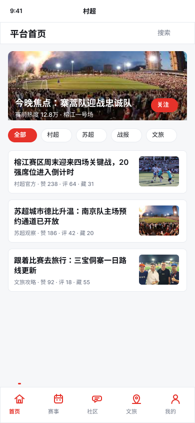

#### 赛事频道｜EXPORT_02_EVENTS_赛事频道
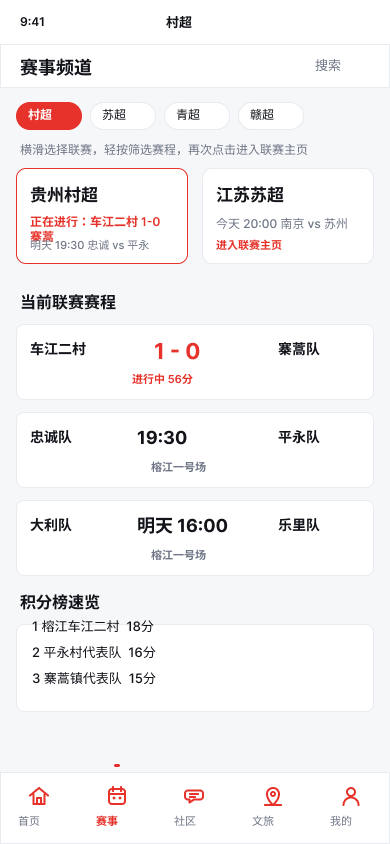

#### 联赛首页｜EXPORT_03_LEAGUE_联赛首页
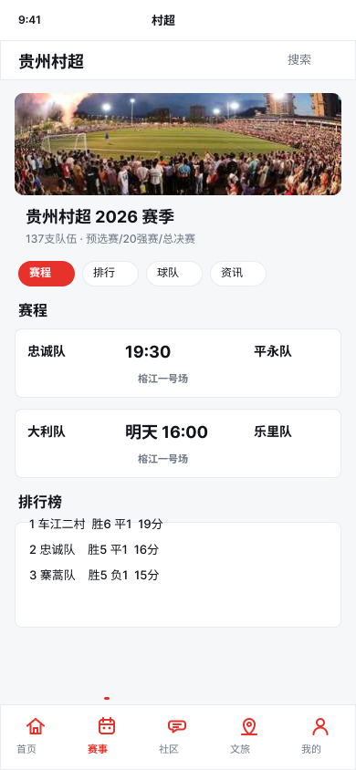

#### 比赛详情｜EXPORT_04_MATCH_比赛详情
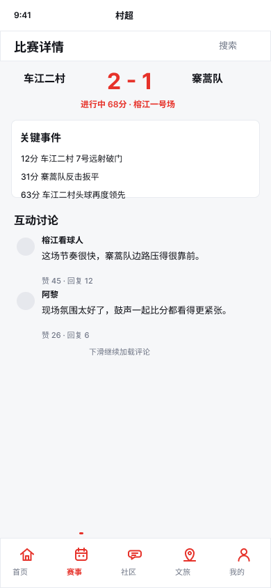

#### 球队详情｜EXPORT_05_TEAM_球队详情
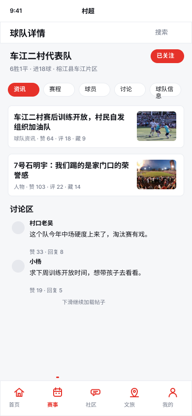

#### 文旅服务｜EXPORT_06_TRAVEL_文旅服务
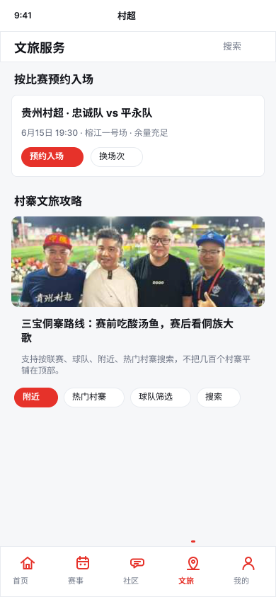

#### 社区｜EXPORT_07_COMMUNITY_社区
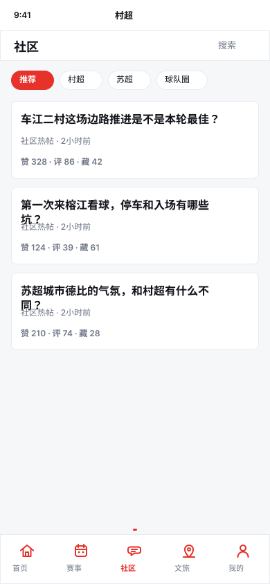

#### 我的｜EXPORT_08_PROFILE_我的关注
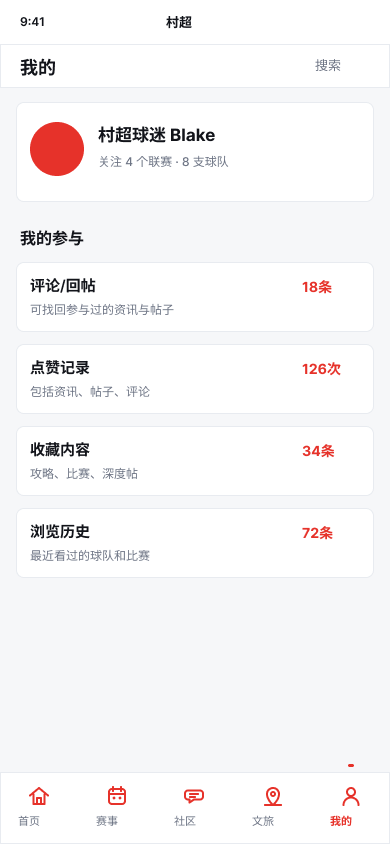

#### 资讯详情｜EXPORT_09_ARTICLE_资讯详情
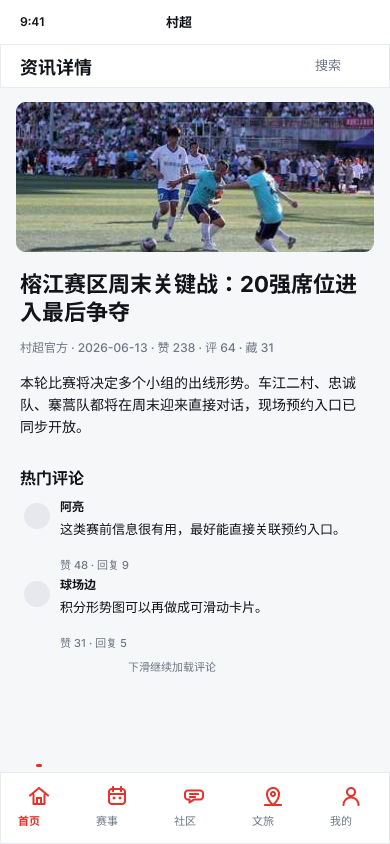

#### 帖子详情｜EXPORT_10_POST_帖子详情
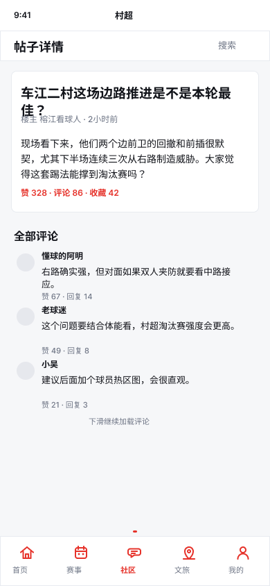

#### 用户路径｜FLOW_核心用户路径
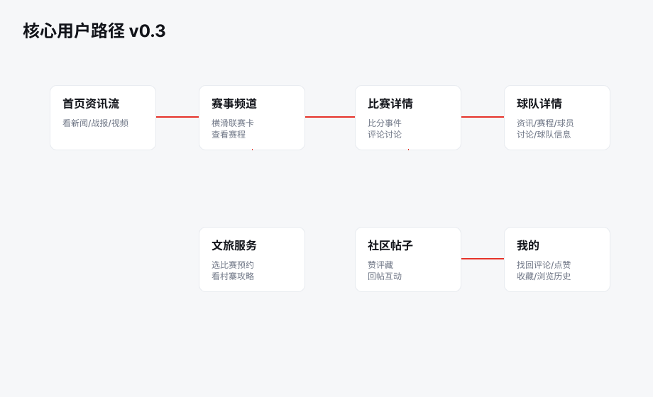

## 参考来源
- [村超官网：赛事情况](https://gzcunchao.com/ssqk)：可核验全年赛事安排、预约入口、官方资讯结构
- [村超官网：预约入场](https://gzcunchao.com/ssfw)：显示官方已有预约入场入口，支持微信扫码快捷预约
- [村超官网：来村超约场球](https://gzcunchao.com/lccycq)：说明官方已有约战/预约类场景，可作为后续社区活动模块参考
- [贵州省政府专题：联赛赛程](https://www.guizhou.gov.cn/ztzl/gzcfa/lssc/)：可作为公开赛程和新闻公告补充来源
- [人民日报/人民网：2026村超赛制报道](https://gz.people.com.cn/n2/2026/0410/c385620-41548037.html)：核验2026年137支队伍、422场预选赛、20强赛、总决赛时间线
- [新华网：榕江足球十年规划](https://www.news.cn/sports/20250531/671e0390e4fa4165a71b579a0de5007a/c.html)：说明村超/班超/逐梦三线体系与长期赛事矩阵
- [贵阳本地宝：村超预约入口说明](https://gy.bendibao.com/xiuxian/2023811/67665.shtm)：提到黔东南一码通小程序为预约入口
- [国家铁路局：贵州村超胜地-魅力榕江](https://www.nra.gov.cn/ztzl/hd/zjrj/dcrj/zjrj/202309/t20230921_343211.shtml)：补充交通、观赛、表演、美食、官方账号等文旅信息
- [中国“村超”及各地业余足球联赛综合研究报告](/Users/blake/Downloads/中国“村超”及各地业余足球联赛综合研究报告.md)：补充苏超、青超、赣超、川超、渝超等多联赛布局依据

## 16. 2026-06-16 版本进展与功能补充（H5 / API / 账号体系）

本节记录自上次 PRD 与 UI 设计稿同步后，产品从“设计原型”进入“可点击 H5 + API 预留 + 自动数据更新 + APK 包装”的新增范围。后续产品、前后端和运营文档以本节作为 v0.2 增量依据。

### 16.1 当前可用版本与部署状态
| 项目 | 当前状态 | 说明 |
|---|---|---|
| H5 测试版 | 已部署 | Vercel 测试地址为 `https://cunchao-static.vercel.app`，用于日常给朋友和合作方体验 |
| 前端技术栈 | 已确定 | React + Vite，按数据层、业务状态、页面组合、组件样式分层，便于后续迁移 App / 小程序 |
| Android APK | 已打包过测试包 | 当前 APK 以 WebView/Capacitor 包装线上 H5，因此内容会随 Vercel 前端和静态数据更新而变化 |
| 后端 API | 已搭建基础服务 | Fastify API 已预留赛事、球队、内容、帖子、预约和账号接口 |
| GitHub 仓库 | 已接入 | 代码、数据更新脚本、自动化工作流均进入仓库管理 |
| 国内访问方案 | 已形成文档 | Vercel 在中国大陆访问不稳定，正式测试建议采用国内 OSS/COS + CDN 或香港节点过渡 |

### 16.2 H5 首版体验优化
| 模块 | 已完成优化 | 后续要求 |
|---|---|---|
| 首页 | 改为高信息密度体育资讯首页，包含焦点比赛、今天看什么、未来赛程、社区热帖、最新资讯 | 后续按用户关注联赛/球队做个性化排序 |
| 赛事 | 增加联赛说明、今日/明日/14天筛选，比赛卡进入比赛详情 | 结构化赛程仍需官方数据或人工维护源 |
| 比赛详情 | 增加比赛事实、球队摘要、预约入场、关注比赛、参与讨论入口 | 生产版需接入实时比分、事件流、阵容与数据员后台 |
| 资讯详情 | 资讯不再只有原文链接，详情页展示图片、来源、发布时间、正文摘要/正文、互动区 | 需持续保留原文链接与来源版权标识 |
| 社区 | 增加 30 个模拟话题、每个话题约 50 条讨论/回复，并加入点赞、评论、收藏数据 | 真实上线前需接入审核、举报、敏感词和运营精选机制 |
| 文旅 | 改为“跟着比赛去村寨”，按未来 14 天比赛匹配村寨/球队卡片 | 已抓取过的村寨资料应缓存复用，避免重复抓取 |
| 我的 | 记录本地互动、关注、评论、点赞、收藏、浏览等行为 | 登录后需要从服务端同步跨设备行为 |
| 顶部沉浸 | H5 去掉多余白色顶部状态栏；APK 尽量全屏隐藏系统顶部栏 | iOS/Android 真机仍需分别做安全区适配 |

### 16.3 每日数据更新工作流
| 数据类型 | 当前方案 | 更新频率 | 产品表现 |
|---|---|---|---|
| 新闻资讯 | 从官方、政府专题、权威媒体等公开来源抓取，生成静态 `bootstrap.json` | GitHub Actions 每天北京时间 08:30 | 新资讯排在前面，旧资讯长期保留 |
| 资讯图片/正文 | 资讯详情页尽量保存图片、正文摘要/正文与来源信息，不只保留原文链接 | 随每日任务更新 | 用户可在站内完成基本阅读，再跳转原文核验 |
| 未来赛程 | 合并公开赛程文章与 `data/manual/matches.json` 的结构化比赛 | 与资讯每日任务一起更新 | 赛事页展示未来 14 天对战球队、时间、地点，未开赛不显示比分 |
| 文旅卡片 | 根据未来 14 天比赛匹配村寨、球队、场地和旅游攻略 | 每次赛事数据更新后检查 | 若村寨资料已入库则直接复用；缺失时再补充抓取/人工维护 |
| 村寨图片 | 工作流要求为每个村寨查找更相关的村寨/目的地图片 | 文旅资料新增时执行 | 避免使用与村寨不相关的随机图片 |
| 社区头像 | 已加入约 50 张随机头像池，模拟用户评论时随机分配 | 新增模拟内容时执行 | 保留现有评论数量，同时提高讨论真实感 |

自动化发布链路：每日任务生成 `apps/web/public/data/bootstrap.json`，构建并验证前端；若数据有变化，自动提交 `Update public data`，再部署到 Vercel Production。用户打开 H5/APK 时会读取最新静态数据。

### 16.4 账号体系与真实登录
| 能力 | 当前接口/实现 | 说明 |
|---|---|---|
| 手机验证码发送 | `POST /api/auth/phone/code` | 使用腾讯云短信 `SendSms`，不再使用固定验证码或本地伪登录 |
| 手机验证码登录 | `POST /api/auth/phone/login` | 校验验证码后返回 `AuthSession` |
| 微信登录 | `POST /api/auth/wechat/login` | 小程序环境通过 `wx.login` 获取 code，后端调用微信 `jscode2session` 换取 openid |
| 当前用户 | `GET /api/auth/me` | 通过 `Authorization: Bearer <token>` 获取当前登录用户 |
| 退出登录 | `POST /api/auth/logout` | 清理当前 session |
| 前端触发点 | 评论、回复、收藏、关注、预约入场 | 未登录时拉起登录弹层 |

账号体系关键环境变量：

| 类型 | 环境变量 | 用途 |
|---|---|---|
| 微信登录 | `WECHAT_APP_ID`, `WECHAT_APP_SECRET` | 调用微信 `jscode2session` |
| 腾讯云短信 | `TENCENT_SECRET_ID`, `TENCENT_SECRET_KEY`, `TENCENT_SMS_APP_ID`, `TENCENT_SMS_SIGN_NAME`, `TENCENT_SMS_TEMPLATE_ID`, `TENCENT_SMS_REGION` | 发送真实短信验证码 |
| 验证码安全 | `AUTH_CODE_PEPPER` | 验证码哈希加盐 |
| 前端 API | `VITE_API_BASE_URL` | H5 指向后端 API 域名 |

生产化要求：当前用户、验证码和 session 仍是 Node 内存存储，适合联调和单实例测试；正式上线前必须改为数据库 + Redis，并补齐手机号/IP/设备限流、账号合并、refresh token、审计日志和隐私合规弹窗。

### 16.5 后端与数据接口补充
| 接口 | 用途 | 生产化备注 |
|---|---|---|
| `GET /api/bootstrap` | 首屏聚合数据 | 后续可由静态 JSON 过渡到 CDN 缓存 API |
| `GET /api/leagues` | 联赛列表 | 需支持多联赛排序、地区、热度和关注态 |
| `GET /api/matches` | 比赛列表 | 需支持联赛、日期、状态、球队、场地筛选 |
| `GET /api/matches/:id` | 比赛详情 | 需接入比分、事件、阵容、评论与预约 |
| `GET /api/teams/:id` | 球队详情 | 需接入球队资料、球员、赛程、讨论和文旅 |
| `GET /api/content/:id` | 资讯详情 | 需保留来源、图片、正文、版权和互动数据 |
| `GET /api/posts/:id` | 帖子详情 | 需接入评论分页、点赞、举报、审核 |
| `GET /api/bookings` | 可预约场次 | 需和官方/第三方预约平台打通或跳转 |

### 16.6 新增产品需求
- 数据后台必须支持“自动抓取 + 人工审核 + 官方数据导入”三种数据来源，并记录每条数据的来源、更新时间、可信等级和最后审核人。
- 资讯详情必须优先站内可读，同时保留原文链接；若版权不允许全文抓取，则至少展示标题、封面图、摘要、来源、发布时间和跳转入口。
- 赛事页默认展示未来 14 天比赛；未开始比赛不显示比分，只显示时间、球队、场地、联赛和预约/提醒入口。
- 文旅页的主逻辑从静态攻略改为“由未来比赛驱动的村寨/球队攻略”，包括村寨介绍、球队介绍、队员介绍、旅游、住宿、饮食、交通和比赛日建议。
- 社区模拟内容只用于测试氛围和样式，正式上线必须区分真实用户内容、运营初始化内容和机器生成种子内容，避免误导用户。
- 用户在资讯、帖子、评论、球队、比赛、文旅攻略中的点赞、评论、收藏、关注、预约，都需要沉淀到“我的”。
- Android APK 当前可跟随 H5/Vercel 内容变化；若后续要上架应用市场，需要补充原生启动页、隐私政策、权限说明、推送、版本更新和备案合规。

### 16.7 下一步优先级
| 优先级 | 工作项 | 目标 |
|---|---|---|
| P0 | 数据持久化 | 用 PostgreSQL/MySQL + Redis 替代内存用户/session/验证码，并保存互动行为 |
| P0 | 真实 API 部署 | 为 H5、小程序和 APK 提供稳定后端域名，配置 `VITE_API_BASE_URL` |
| P0 | 数据合作清单 | 明确村超、苏超、青超等联赛的赛程、比分、球队、球员和预约数据责任方 |
| P1 | 小程序适配 | 将微信登录、订阅消息、预约跳转、分享卡片按小程序规范落地 |
| P1 | 内容审核后台 | 支持资讯入库审核、社区帖子/评论审核、举报处理和敏感词 |
| P1 | 国内部署 | 准备备案域名、国内 OSS/COS + CDN，降低大陆用户访问门槛 |
| P2 | 数据看板 | 追踪资讯更新量、比赛覆盖率、用户互动、热门球队和文旅点击 |

## 17. 2026-06-16 管理后台与后端能力补充

本轮新增运营管理后台，用于支撑资讯/赛事类产品的日常运营、数据审核和增长看板。后台首版已接入 H5 `/admin` 路径，并新增管理后端接口和 Vercel serverless 接口。详细后端 PRD 见 `docs/admin-backend-prd.md`。

### 17.1 后台模块
| 模块 | 首版能力 | 后续生产化 |
|---|---|---|
| 总览 | DAU、平均观看时长、资讯 CTR、预约转化、内容池规模、模块健康度 | 接真实埋点仓库、告警和运营日报 |
| 内容上新 | 新建资讯/视频/战报/攻略/公告草稿，查看审核队列 | CMS 富文本、图片上传、定时发布、版本回滚 |
| 赛事管理 | 未来比赛核验、赛程数据结构、比分事件规划 | 官方数据导入、比分录入、积分榜计算 |
| 球队球员 | 球队资料、球员字段、球队管理员认领规划 | 授权资料库、纠错流程、敏感信息保护 |
| 文旅攻略 | 按未来比赛匹配村寨攻略、住宿餐饮、图片素材 | 商户后台、路线编辑、攻略复用和版权管理 |
| 社区审核 | 帖子评论巡检、治理能力清单 | 敏感词、举报工单、禁言、删除、置顶和精选 |
| 数据看板 | 页面 PV、平均时长、CTR、预约漏斗、事件字典 | PostHog/ClickHouse/数据仓库 |
| 系统设置 | 角色权限、数据源、发布流、审计日志规划 | RBAC、API 密钥、灰度发布 |

### 17.2 内容生产板块
| 内容类型 | 前台分发位置 | 关键字段 |
|---|---|---|
| 快讯/新闻 | 首页信息流、资讯详情 | 标题、摘要、正文、封面图、来源、发布时间、原文链接 |
| 赛前前瞻 | 首页、赛事页、比赛详情 | 对阵、看点、双方近况、预约说明 |
| 赛后战报 | 首页、比赛详情、球队页 | 比分、关键事件、最佳球员、评论热度 |
| 视频/图集 | 首页、资讯详情、球队页 | 封面、视频/图集地址、版权说明 |
| 球队故事 | 球队页、首页专题 | 村寨故事、球队历史、荣誉、人物 |
| 文旅攻略 | 文旅页、比赛详情 | 村寨介绍、路线、住宿、餐饮、交通、图片来源 |
| 官方公告 | 首页、赛事页 | 正文、有效期、发布单位 |
| 社区精选 | 社区、首页热帖 | 帖子、作者、精选理由、审核状态 |

### 17.3 后端接口与埋点
| 接口/事件 | 类型 | 用途 | 当前状态 |
|---|---|---|---|
| `/api/admin/overview` | GET | 后台总览、模块健康度、漏斗、事件字典 | Fastify 与 Vercel serverless 已开发 |
| `/api/admin/content/drafts` | POST | 创建内容草稿并进入审核队列 | Fastify 已开发，前端首版用 localStorage 草稿 |
| `/api/analytics/events` | POST | 接收页面浏览、点击、预约、评论、收藏等事件 | Fastify 与 Vercel serverless 已开发 |
| `page_view` | 埋点 | DAU、路径分析、页面 PV | 事件字典已定义 |
| `content_click` | 埋点 | 内容 CTR、推荐效果 | 事件字典已定义 |
| `match_click` | 埋点 | 赛事详情转化、热门比赛 | 事件字典已定义 |
| `booking_click` | 埋点 | 预约漏斗 | 事件字典已定义 |
| `comment_submit` | 埋点 | 社区活跃 | 事件字典已定义 |
| `favorite_toggle` | 埋点 | 我的沉淀、内容收藏率 | 事件字典已定义 |

### 17.4 当前实现边界
- `/admin` 已可作为桌面管理后台入口，用于产品评审和运营流程确认。
- 后台首版基于现有静态数据推导看板，内容草稿保存在浏览器 localStorage。
- Vercel 线上测试版可访问基础管理接口，但正式后台仍需要后台登录、数据库、权限、审计和审核队列。
- 生产化前必须接入数据库、对象存储、真实埋点 SDK、RBAC 权限和内容安全审核。
